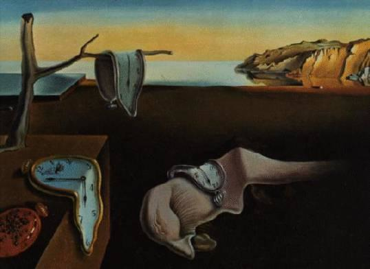

```{r, include = FALSE}
knitr::opts_chunk$set(
  echo = TRUE
)
```

## LDheatmap 

`LDheatmap()` is used to produce a graphical display,
as a heat map, of pairwise linkage disequilibrium (LD) 
measurements for SNPs.
The heat map is a false color image in the upper-left 
diagonal of a square plot. A line parallel to 
the diagonal of the image indicating
the physical or genetic map positions of the SNPs 
may be added, along
with text reporting the total length of the genomic 
region considered. Users may also display the heatmap
"flipped" below a horizontal line indicating the map
positions of the SNPs. In this orientation, 
tracks may be added above the genetic map.

## Installation

```{r,eval=FALSE}
# Install the latest release version from CRAN with
install.packages("LDheatmap")

# Install the latest development version from GitHub with
devtools::install_github("mcneney/LDheatmap")
```


## Homepage

https://sfustatgen.github.io/LDheatmap/index.html

